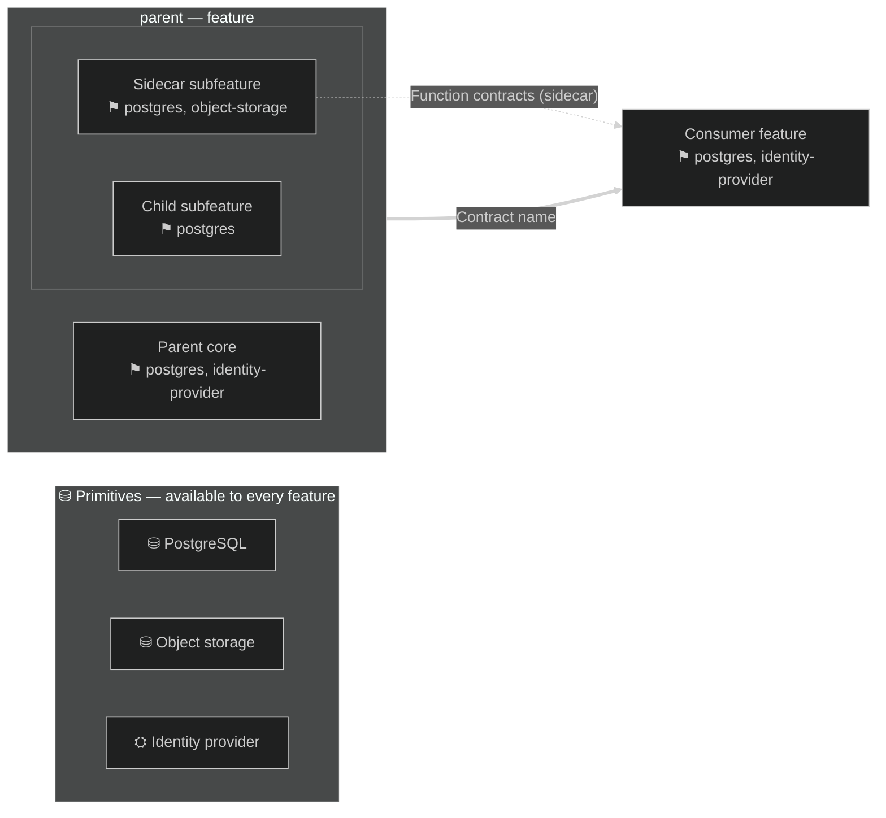
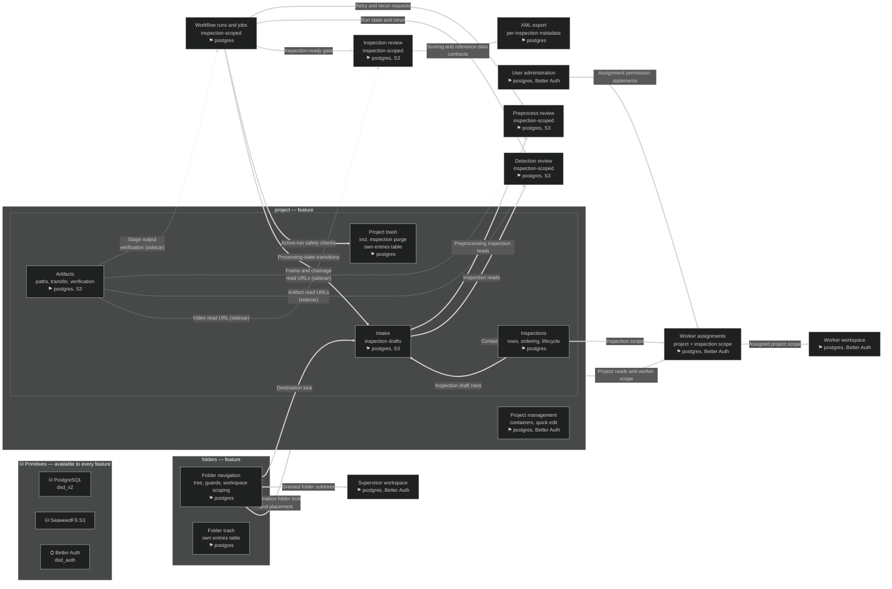

# Feature diagram guide

Conventions for drawing a feature architecture as one Mermaid flowchart that separates
composition (what a feature is made of) from dependency (what a feature consumes). Adapt the
example domains to the target repository. When the deliverable is a whole feature-layout
directory (overview, detail views, flows, external services, roadmap) rather than a single
diagram, read [layout-conventions.md](layout-conventions.md) as well.

## Contents

- [Vocabulary](#vocabulary)
- [The classification questions](#the-classification-questions)
- [Mermaid skeleton](#mermaid-skeleton)
- [Composition: feature boxes and compartments](#composition-feature-boxes-and-compartment)
- [Dependency arrows: provider to consumer](#dependency-arrows-provider-to-consumer)
- [Sidecars and promotion to shared services](#sidecars-and-promotion-to-shared-services)
- [Primitives band and tags](#primitives-band-and-tags)
- [Status markers, never roadmap colors](#status-markers-never-roadmap-colors)
- [Dark theme and rendering](#dark-theme-and-rendering)
- [Verification](#verification)
- [Worked example](#worked-example)

## Vocabulary

| Term | Meaning | How it appears |
| --- | --- | --- |
| Feature | A capability with its own client surface and lifecycle | Top-level box |
| Shared service | Reusable application state and rules behind public contracts, consumed by several features | Own box; own view under `services/` |
| Subfeature | A capability composed inside a feature; no independent surface or lifecycle | Compartment inside the parent box |
| Sidecar | A subfeature that outside consumers reach through the parent's runtime | Compartment with dashed border; dashed arrows out |
| Primitive | A building block: database, object storage, identity provider | Node in a foundation band; never an arrow target |
| Composition | "is part of" | Enclosure (compartment) |
| Dependency | "consumes" | Solid arrow, drawn **from provider to consumer** |

## The classification questions

Ask in order. Stop at the first match.

1. **Is it a primitive?** Database, object storage, identity provider, cache, message bus. It has
   no product behavior; it stores or transports. → foundation band, tag on consumers.
2. **Does it have its own client surface or lifecycle?** Routes, UI pages, or state that survives
   independently. → top-level feature box.
3. **Does it own persistent state plus reusable contracts that several features consume?**
   Registries, resolvers, deletion and maintenance workflows shared across features. →
   **shared service**: its own box in the overview and its own view under `services/`.
   Persistent state and coordination rules distinguish it from a small utility such as a URL
   formatter.
4. **Is it consumed from outside its parent through the parent's runtime?** Other features call
   its functions via the parent, but it has no routes or pages. → sidecar compartment.
5. **Everything else.** A capability that only makes sense inside one feature. → plain
   subfeature compartment.

Example distinctions: a folder *tree* is a feature (own routes `/folders/*`, own navigation UI).
Folder *trash* is a subfeature (no routes; folders feature exposes trash endpoints). Artifact
*path derivation and verification* is a sidecar (no routes; intake, reviews, and a reconciler call
its functions). A *media manager* with asset records, a reference registry, and cleanup workflows
consumed by SKU, redemption, and catalog is a shared service, not a sidecar of the admin UI that
browses it.

Two guardrails keep the layers honest: a shared service is not a mandatory wrapper around every
query — features access primitives directly for their own data — and a "public contract" is an
intentional in-application API, not anonymous HTTP; admin routes stay responsible for access
checks.

## Mermaid skeleton



## Composition: feature boxes and compartments

- One `subgraph` per top-level feature. Label it `name — feature`.
- Subfeatures are plain nodes inside the parent's subgraph. Group homogeneous compartments in an
  inner anonymous subgraph (`subgraph internals[" "]`) with `direction LR` to keep the box compact.
- A compartment never has its own `subgraph` label beyond the anonymous grouping. Nesting depth
  beyond two renders poorly; express deeper composition in the node label instead.
- If a compartment belongs to two parents conceptually (a shared mechanism), it is not a
  compartment — it is a shared service, a primitive, or the concept is split per parent.

## Dependency arrows: provider to consumer

Arrows have orientation semantics: **A → B means B depends on A**. The arrow starts at the
feature or service *providing* the contract and points at the *consumer*. State the rule under
every diagram that uses it; readers otherwise assume left-to-right means depends-on.

- Solid double-arrow (`==>`) with a short label naming the contract: `"Destination folder lock"`,
  `"Order read contract: authorized status and customer-safe snapshot"`.
- Arrows run provider-to-consumer between features, from a shared service to its consumers, and
  from a feature to another feature's named subfeature. Never feature-to-primitive.
- Delete an arrow when the label only restates storage or authentication ("stores rows in
  postgres"). That fact belongs in the consumer's primitive tag.
- Sidecar consumption uses dashed arrows (`-.->`) with `(sidecar)` in the label, still drawn
  provider-to-consumer.
- If two arrows connect the same pair with different contracts, keep both; labels carry the
  meaning.
- Diagrams omit internal calls and plugin registrations; say so in a sentence under the diagram
  so omission is not mistaken for absence.

## Sidecars and promotion to shared services

A sidecar is drawn with a dashed border (`stroke-dasharray:4` in its `classDef`) and dashed
outbound arrows. It signals: *composed here, consumed there*. Canonical cases: artifact path
derivation and verification; a formatting or reporting module consumed by routes outside the
parent.

Do not make a sidecar out of something with its own routes — that is a feature. Do not keep a
sidecar as a compartment once it accumulates **owned persistent state** (its own tables) and
**public contracts** consumed by several features: promote it to a shared service with its own
box and its own view under `services/`, and retire the dashed compartment rather than keeping
two competing classifications. The migration note belongs in the roadmap, not in both diagrams.

## Primitives band and tags

- One `subgraph primitives[...]` with `direction LR` at the top. Cylinder shape (`[( )]`) for
  storage services, plain boxes for others.

- No arrows touch the band. The band is a legend.
- Every feature and subfeature node ends with a `⚑` line naming its primitives, e.g.
  `⚑ postgres, S3`. Consistency matters more than the marker glyph; keep one glyph per primitive
  across the diagram.
- If a feature's primitive set would be identical to its parent's, still write the tag —
  self-contained nodes are easier to audit than inherited ones.

## Status markers, never roadmap colors

Diagram colors are structural, not temporal. Do not color nodes by roadmap state and do not keep
a rework table keyed by color. Status lives in prose and tables where it can carry nuance:

- **Status line** at the top of a roadmap entry: `Status: **planned — initial dev CRUD exists**`.
- **Implementation-alignment tables** in each detail view (`Area | Current evidence | Remaining
  work / target boundary`), which cite real files, methods, and routes as evidence.
- **Drafted features** get a full detail view plus a README index note: "Its layout is drafted;
  the feature is not yet implemented — see the roadmap."

This keeps architecture stable while implementation moves: re-coloring the diagram every sprint
would change its meaning without changing the architecture.

## Dark theme and rendering

Start every diagram with:

```text
%%{init: {"theme":"dark","themeVariables":{"darkMode":true,"background":"#1e1e1e","fontFamily":"ui-monospace,SFMono-Regular,Menlo,monospace"}}}%%
```

- Use `<br/>` for node line breaks (reliable across renderers); avoid `\n`.
- Escape path separators inside labels as `&lt;` and `&gt;` when they could read as HTML
  (`projects/&lt;id&gt;/`).
- Never put a space between a node id and its opening bracket inside a `subgraph`; `I1["x"]` with
  a space parses, `I1 ["x"]` fails on several renderer versions.
- Keep `--> statement-breakpoint`-style artifacts out of diagram blocks; one statement per line.

## Verification

Verify before delivering and re-verify after every edit.

1. Compile every diagram with mermaid-cli, twice when using theme directives (once default, once
   dark; both must succeed):

   ```bash
   npm install @mermaid-js/mermaid-cli
   npx mmdc -i diagram.mmd -o out.svg --puppeteerConfigFile <(echo '{"args":["--no-sandbox"]}')
   ```

   Check exit status and the SVG's existence, that every subgraph label appears in the SVG text,
   that theme colors are present, and that width stays readable (over ~3000px usually means
   split or linearize).

2. Check every relative Markdown link resolves from its containing file:

   ```bash
   grep -rEo "^[^:]+:\]\([^)#]+\.md" --include="*.md" docs/feature-layout \
     | sed 's/](//' | while IFS=: read -r src link; do
         d=$(dirname "$src"); [ -f "$d/$link" ] || echo "BROKEN: $src -> $link"; done
   ```

3. Re-read each edited view for the proposed-vs-implemented boundary: no sentence may present a
   *proposed* contract as existing.

Failure modes seen in practice: labels containing raw `<id>` (escape as `&lt;id&gt;`); node ids
with a space before `[`; `-->` written as `->` in flowcharts; `subgraph` titles containing
unescaped quotes; composite `stateDiagram` nesting that explodes width — linearize instead;
arrows redrawn consumer-to-provider after a refactor, silently inverting dependency semantics;
links written from the directory root instead of from the containing file.

## Worked example

A media-review platform with a two-level container model. Decisions already made: projects are
containers; inspections are the unit of work (one video each); all metadata follows the video;
folders organize containers and are a prerequisite feature, not a subfeature; trash is owned per
feature with no shared entries table. Arrows run provider → consumer; colors are omitted on
purpose — implementation status belongs in roadmap prose, not in the diagram.



Reading notes delivered with the diagram:

- Enclosure = composition; arrows = dependency, drawn provider → consumer (`A → B means B
  depends on A`), with the rule stated under the diagram.
- `folderTrash` is enclosed because folder trash has no surface without the folders feature.
- `artifacts` is a sidecar: it composes into the project feature, but intake, the reviews, and
  the reconciler consume its functions through the project runtime. If it later owns its own
  tables and public contracts, promote it to a shared service with a view under `services/`.
- Primitives appear only in the band and as `⚑` tags; no feature node has an arrow to postgres.
- Implementation status is not drawn: the delivery note says which nodes are drafted and points
  at the roadmap, keeping the diagram's meaning stable across sprints.
