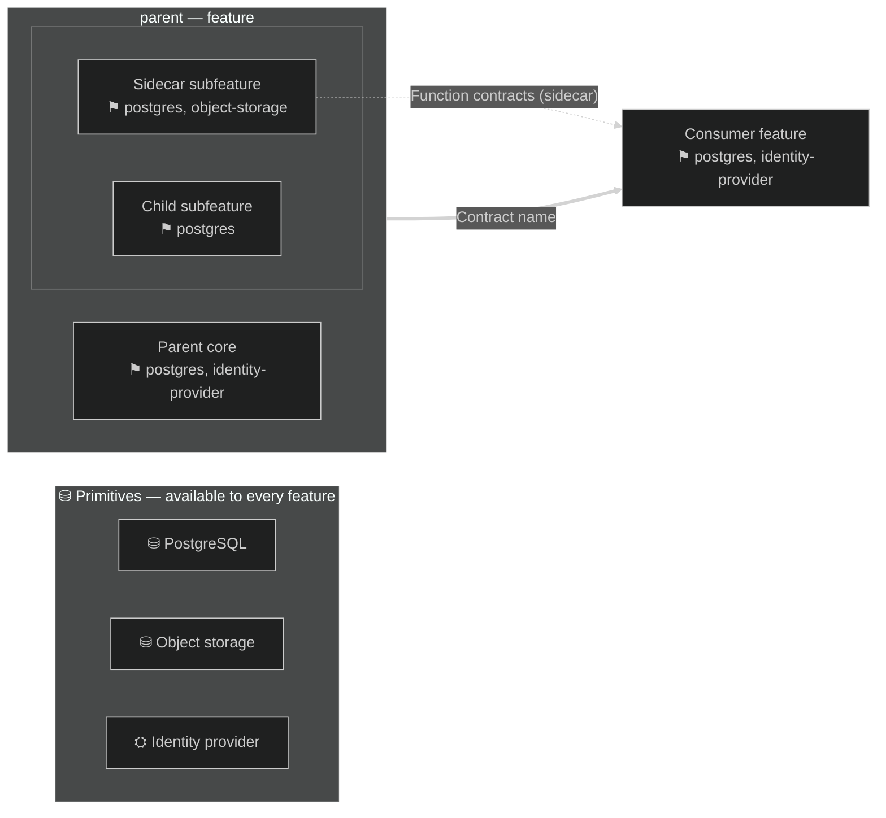
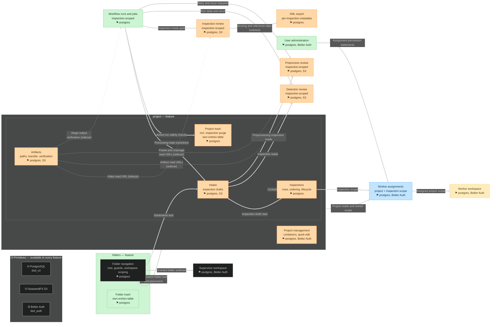

# Feature diagram guide

Conventions for drawing a feature architecture as one Mermaid flowchart that separates
composition (what a feature is made of) from dependency (what a feature consumes). Adapt the
example domains to the target repository.

## Contents

- [Vocabulary](#vocabulary)
- [The four classification questions](#the-four-classification-questions)
- [Mermaid skeleton](#mermaid-skeleton)
- [Composition: feature boxes and compartments](#composition-feature-boxes-and-compartment)
- [Dependency arrows](#dependency-arrows)
- [Sidecars](#sidecars)
- [Primitives band and tags](#primitives-band-and-tags)
- [Roadmap coloring and rework table](#roadmap-coloring-and-rework-table)
- [Dark theme and rendering](#dark-theme-and-rendering)
- [Compile verification](#compile-verification)
- [Worked example](#worked-example)

## Vocabulary

| Term | Meaning | How it appears |
| --- | --- | --- |
| Feature | A capability with its own client surface and lifecycle | Top-level box |
| Subfeature | A capability composed inside a feature; no independent surface or lifecycle | Compartment inside the parent box |
| Sidecar | A subfeature that outside consumers reach through the parent's runtime | Compartment with dashed border; dashed arrows out |
| Primitive | A building block: database, object storage, identity provider | Node in a foundation band; never an arrow target |
| Composition | "is part of" | Enclosure (compartment) |
| Dependency | "consumes" | Solid arrow between features; dashed arrow to a sidecar |

## The four classification questions

Ask in order. Stop at the first match.

1. **Is it a primitive?** Database, object storage, identity provider, cache, message bus. It has
   no product behavior; it stores or transports. → foundation band, tag on consumers.
2. **Does it have its own client surface or lifecycle?** Routes, UI pages, or state that survives
   independent of any other feature. → top-level feature box.
3. **Is it consumed from outside its parent through the parent's runtime?** Other features call
   its functions via the parent, but it has no routes or pages. → sidecar compartment.
4. **Everything else.** A capability that only makes sense inside one feature. → plain
   subfeature compartment.

Example distinctions: a folder *tree* is a feature (own routes `/folders/*`, own navigation UI).
Folder *trash* is a subfeature (no routes; folders feature exposes trash endpoints). Artifact
*path derivation and verification* is a sidecar (no routes; intake, reviews, and a reconciler call
its functions).

## Mermaid skeleton



## Composition: feature boxes and compartments

- One `subgraph` per top-level feature. Label it `name — feature`.
- Subfeatures are plain nodes inside the parent's subgraph. Group homogeneous compartments in an
  inner anonymous subgraph (`subgraph internals[" "]`) with `direction LR` to keep the box compact.
- A compartment never has its own `subgraph` label beyond the anonymous grouping. Nesting depth
  beyond two renders poorly; express deeper composition in the node label instead.
- If a compartment belongs to two parents conceptually (a shared mechanism), it is not a
  compartment — it is either a primitive, or the concept is split per parent.

## Dependency arrows

- Solid double-arrow (`==>`) with a short label naming the contract: `"Destination folder lock"`,
  `"Stage output verification"`, `"Active-run safety checks"`.
- Arrows run feature-to-feature or feature-to-named-subfeature of another feature. Never
  feature-to-primitive.
- Delete an arrow when the label only restates storage or authentication ("stores rows in
  postgres"). That fact belongs in the consumer's primitive tag.
- Sidecar consumption uses dashed arrows (`-.->`) with `(sidecar)` in the label.
- If two arrows connect the same pair with different contracts, keep both; labels carry the
  meaning.

## Sidecars

A sidecar is drawn with a dashed border (`stroke-dasharray:4` in its `classDef`) and dashed
outbound arrows. It signals: *composed here, consumed there*. Canonical cases: artifact path
derivation and verification; a persistence adapter consumed by several sibling features through
the parent runtime; a formatting or reporting module consumed by routes outside the parent.

Do not make a sidecar out of something with its own routes — that is a feature.

## Primitives band and tags

- One `subgraph primitives[...]` with `direction LR` at the top. Cylinder shape (`[( )]`) for
  storage services, plain boxes for others.
- No arrows touch the band. The band is a legend.
- Every feature and subfeature node ends with a `⚑` line naming its primitives, e.g.
  `⚑ postgres, S3`. Consistency matters more than the marker glyph; keep one glyph per primitive
  across the diagram.
- If a feature's primitive set would be identical to its parent's, still write the tag —
  self-contained nodes are easier to audit than inherited ones.

## Roadmap coloring and rework table

One `classDef` per roadmap state, applied via `class` lines:

- `complete` — shipped, stable. Green (`fill:#CDF4D3,stroke:#66D575`).
- `buildFirst` — the next implementation target. Blue (`fill:#C2E5FF,stroke:#3DADFF`).
- `buildNext` — queued immediately behind the target. Yellow (`fill:#FFECBD,stroke:#FFC943`).
- `rework` — shipped but requires restructuring. Orange (`fill:#FFD8A8,stroke:#FF922B`).
- `sidecar` — same fill as rework plus `stroke-dasharray:4` when the sidecar is also in rework;
  use a solid dashed variant with the state color otherwise.

Add `color:#1b3a24`-style dark text colors so labels stay legible on the fills, and set
`"background":"#1e1e1e"` in the init for dark-theme viewers.

Under the diagram, keep a rework table: one row per colored node, columns `Node | Today | Rework
required`. Every colored node appears exactly once. Rows describe data-contract changes first;
UI and route work follows.

## Dark theme and rendering

Start every diagram with:

```text
%%{init: {"theme":"dark","themeVariables":{"darkMode":true,"background":"#1e1e1e","fontFamily":"ui-monospace,SFMono-Regular,Menlo,monospace"}}}%%
```

- Use `<br/>` for node line breaks (reliable across renderers); avoid `\n`.
- Escape path separators inside labels as `&lt;` and `&gt;` when they could read as HTML
  (`projects/&lt;id&gt;/`).
- Never put a space between a node id and its opening bracket inside a `subgraph`; `I1["x"]` with
  a space parses, `I1 ["x"]` fails on several renderer versions.
- Keep `--> statement-breakpoint`-style artifacts out of diagram blocks; one statement per line.

## Compile verification

Verify with mermaid-cli before delivering; re-verify after every edit.

```bash
npm install @mermaid-js/mermaid-cli
npx mmdc -i diagram.mmd -o out.svg --puppeteerConfigFile <(echo '{"args":["--no-sandbox"]}')
```

Check on every pass:

1. Exit status is success and the SVG exists.
2. Every subgraph label appears in the SVG text.
3. Theme colors are present (dark fills for dark theme).
4. Diagram width is readable; a state or flowchart over ~3000px wide usually means too many
   chained nodes — split or linearize.
5. Compile twice when using theme directives: once default, once dark. Both must succeed.

Failure modes seen in practice: labels containing raw `<id>` (escape as `&lt;id&gt;`); node ids
with a space before `[`; `-->` written as `->` in flowcharts; `subgraph` titles containing
unescaped quotes; composite `stateDiagram` nesting that explodes width — linearize instead.

## Worked example

A media-review platform with a two-level container model. Decisions already made: projects are
containers; inspections are the unit of work (one video each); all metadata follows the video;
folders organize containers and are a prerequisite feature, not a subfeature; trash is owned per
feature with no shared entries table.



Reading notes delivered with the diagram:

- Enclosure = composition; arrows = runtime dependency.
- `folderTrash` is enclosed because folder trash has no surface without the folders feature.
- `artifacts` is a sidecar: it composes into the project feature, but intake, the reviews, and the
  reconciler consume its functions through the project runtime.
- Primitives appear only in the band and as `⚑` tags; no feature node has an arrow to postgres.
- The rework table maps every orange node to its concrete data-contract change.
