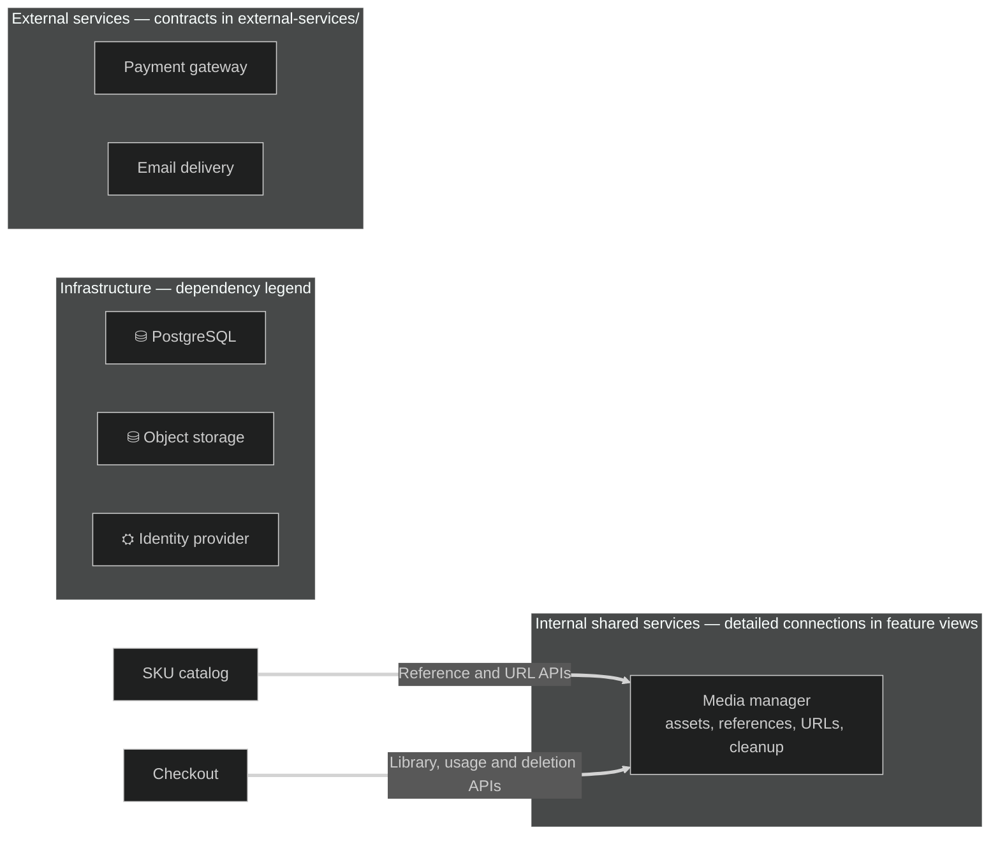
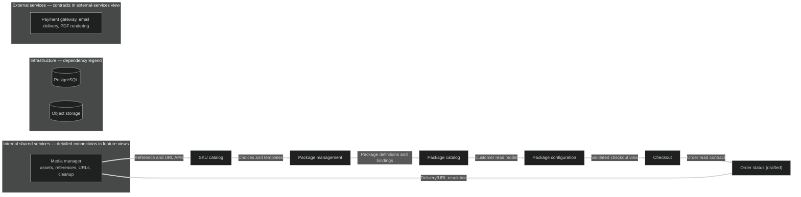
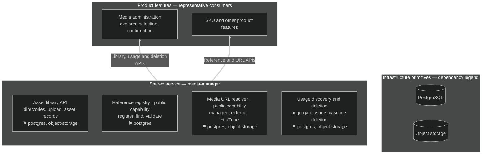

# Feature layout guide

Conventions for documenting a feature architecture as a directory of Markdown views whose
Mermaid diagrams separate composition (what a feature is made of) from dependency (what a
feature consumes). Adapt the example domains to the target repository.

## Contents

- [Vocabulary](#vocabulary)
- [The classification questions](#the-classification-questions)
- [Directory skeleton](#directory-skeleton)
- [Overview README](#overview-readme)
- [Mermaid skeleton](#mermaid-skeleton)
- [Composition: feature boxes and compartments](#composition-feature-boxes-and-compartments)
- [Dependency arrows: provider to consumer](#dependency-arrows-provider-to-consumer)
- [Sidecars and promotion to shared services](#sidecars-and-promotion-to-shared-services)
- [Primitives band and tags](#primitives-band-and-tags)
- [Status markers, never roadmap colors](#status-markers-never-roadmap-colors)
- [Detail-view anatomy](#detail-view-anatomy)
- [Operation flows](#operation-flows)
- [External-service adapter docs](#external-service-adapter-docs)
- [Roadmap](#roadmap)
- [Dark theme and rendering](#dark-theme-and-rendering)
- [Verification](#verification)
- [Worked example](#worked-example)

## Vocabulary

| Term | Meaning | How it appears |
| --- | --- | --- |
| Feature | A capability with its own client surface and lifecycle | Top-level box; own detail view |
| Shared service | Reusable application state and rules behind public contracts, consumed by several features | Own box in overview; own view under `services/` |
| Subfeature | A capability composed inside a feature; no independent surface or lifecycle | Compartment inside the parent box |
| Sidecar | A subfeature that outside consumers reach through the parent's runtime | Compartment with dashed border; dashed arrows out |
| Primitive | A building block: database, object storage, identity provider | Node in a foundation band; never an arrow target |
| Composition | "is part of" | Enclosure (compartment) |
| Dependency | "consumes" | Solid arrow, drawn **from provider to consumer** |

## The classification questions

Ask in order. Stop at the first match.

1. **Is it a primitive?** Database, object storage, identity provider, cache, message bus. It has
   no product behavior; it stores or transports. → foundation band, tag on consumers.
2. **Does it have its own client surface or lifecycle?** Routes, UI pages, or state that survive
   independently. → top-level feature box with a detail view.
3. **Does it own persistent state plus reusable contracts that several features consume?** Media
   management, notifications, numbering, file conversion. → **shared service**: own box in the
   overview and its own view under `services/`. Persistent state and coordination rules
   distinguish it from a small utility such as a URL formatter.
4. **Is it consumed from outside its parent through the parent's runtime, without owning
   state?** → sidecar compartment.
5. **Everything else.** A capability that only makes sense inside one feature. → plain
   subfeature compartment.

Two guardrails: a shared service is not a mandatory wrapper around every query — features access
primitives directly for their own data. And "public contract" means an intentional in-application
API, not anonymous HTTP; admin routes stay responsible for access checks.

## Directory skeleton

One directory, e.g. `docs/feature-layout/`, with subdirectories for services, flows, and
external services. Keep filenames kebab-case and stable; links between views are load-bearing.

```text
docs/feature-layout/
  README.md                  overview: system diagram, category table, detail-view index, flows index
  sku.md                     detail view per product feature
  checkout.md
  order-status.md            drafted feature: documented target, not implemented
  services/
    media-manager.md         detail view per shared service
  flows/
    attach-media.md          one document per multi-step operation
    delete-managed-asset.md
  external-services/
    README.md                adapter-contract inventory
    payment-gateway.md       one document per provider adapter
  roadmap.md                 implementation tasks and prerequisites
```

Rationale for the split: the overview must stay readable, so shared-service connections and
primitive tags are consolidated into summary bands; each detail view expands its own edges.
Frozen or legacy code (e.g. a pre-migration database layer) gets no new behavior and at most a
pointer from the views that replace it.

## Overview README

The README answers "what exists and where do I read more" in five parts:

1. **Scope paragraph** — what the directory describes (target architecture, implementation gaps
   labelled as such), plus explicit out-of-scope features and compatibility guarantees.
2. **System overview diagram** — the main dependency chain only, with a legend sentence:
   *"A → B means B depends on A."* Consolidate shared-service edges into one `services` subgraph
   and primitives into one band; state that detail views expand them.
3. **Category table** — one row per category (product feature, internal shared service, external
   service, infrastructure primitive) with meaning and examples. Follow with two or three
   boundary sentences: features may access primitives directly for their own data;
   "public capability" does not prescribe classes or an OOP hierarchy.
4. **Detail-view index** — a table linking every view with a one-sentence scope, plus a
   consumers paragraph naming which features consume each shared service.
5. **Operation-flows index** — links to flow documents with one-line summaries, then prose
   conventions: enclosure means ownership; arrows name consumed contracts; roadmap status stays
   in prose/tables, never diagram colors.

## Mermaid skeleton



Every view repeats the same `%%{init}` line so all diagrams render identically in dark themes.

## Composition: feature boxes and compartments

- One `subgraph` per top-level feature; label detail boxes `name — product feature` (or
  `— shared service`). Subfeatures are plain nodes inside the parent's subgraph; group
  homogeneous compartments in an inner anonymous subgraph with `direction LR`.
- Nesting depth beyond two renders poorly; express deeper composition in the node label.
- A compartment belongs to exactly one parent. A capability needed by two parents is either a
  shared service or a per-parent pair of compartments.

## Dependency arrows: provider to consumer

Arrows have orientation semantics: **A → B means B depends on A**. The arrow starts at the
feature or service *providing* the contract and points at the *consumer*. State the rule under
every diagram that uses it; readers otherwise assume left-to-right = depends-on.

- Solid double-arrow (`==>`) with a short contract label: `"Reference and URL APIs"`,
  `"Order read contract: authorized status and customer-safe snapshot"`.
- Arrows run provider-to-consumer between features, from a shared service to its consumers, and
  from a feature to another feature's named subfeature. Never feature-to-primitive.
- Delete an arrow whose label only restates storage or authentication ("stores rows in
  postgres"); that fact belongs in the consumer's `⚑` tag.
- Sidecar consumption uses dashed arrows (`-.->`) with `(sidecar)` in the label, still drawn
  provider-to-consumer.
- Two arrows between the same pair with different contracts: keep both; labels carry the meaning.
- Diagrams omit internal calls and plugin registrations; say so in a sentence under the diagram
  so omission is not mistaken for absence.

## Sidecars and promotion to shared services

A sidecar is composed in one feature and consumed through that parent's runtime: dashed border
(`stroke-dasharray:4`), dashed outbound arrows. Canonical cases: a formatting or derivation
helper, an adapter consumed by siblings via the parent.

Promote to a shared service when the capability accumulates **owned persistent state** (its own
tables) and **public contracts** consumed by several features — registry, delivery, deletion,
maintenance. Draw it as its own box with its own view under `services/`; consumers keep arrows
into it. Do not keep the old dashed compartment as a duplicate: one capability, one
classification, and the migration note lives in the roadmap, not in two competing diagrams.

## Primitives band and tags

- One `subgraph primitives[...]` with `direction LR`, titled as a legend
  (`Infrastructure — dependency legend`). Cylinders (`[( )]`) for storage.
- No arrows touch the band, in either direction. Consumption is documented solely as a `⚑`
  line in the consumer's node label, e.g. `⚑ postgres, object-storage`. Keep one glyph per
  primitive across every view.
- Write the tag even when it matches the parent's; self-contained nodes audit easier.

## Status markers, never roadmap colors

Diagram colors are structural, not temporal. Do not color nodes by roadmap state and do not keep
a rework table keyed by color. Instead:

- **Status line** at the top of a roadmap entry: `Status: **planned — initial dev CRUD exists**`.
- **Implementation-alignment tables** in each detail view (see below).
- **Drafted features** get a detail view plus a status sentence in the README index: "Its layout
  is drafted; the feature is not yet implemented — see the roadmap."

This keeps architecture stable while implementation moves: re-drawing the diagram every sprint
would change its meaning without changing the architecture.

## Detail-view anatomy

Each feature and shared-service view follows this order:

1. **Ownership paragraph** — one sentence of what the capability owns, one of what it explicitly
   does not own (usually the neighboring contract), and a link to that neighbor. For a shared
   service, name the layering: product features consume shared services; shared services
   coordinate primitives.
2. **Ownership diagram** — primitives band, owned compartments, labelled arrows in. One-sentence
   legend plus any deliberate omission.
3. **Public contracts table** — `Contract | Responsibility | Consumers`. Define "public" in
   prose: an intentional in-application API, not anonymous HTTP.
4. **Dependencies-consumed table** — `Dependency | What it is used for | Boundary`.
5. **Implementation-alignment table** — `Area | Current evidence | Remaining work / target
   boundary`. "Current evidence" cites real files, methods, or routes; the remaining-work column
   is the target, not a promise.
6. **Code references** — relative links into the repository for the named contracts.

Prose rules: separate intended design from current implementation in the first paragraph;
label not-yet-existing contracts *proposed*; state non-goals ("reads; does not write order or
payment state"); keep cross-feature decisions in the roadmap and link them from every affected
view so each decision is made exactly once.

## Operation flows

Multi-step operations (attach, read, delete-with-confirmation, checkout) get one document under
`flows/` each. Structural views show ownership; flow documents show **execution order and
decisions**:

- `flowchart TD` with numbered or sequentially labelled arrows; decisions as diamond nodes.
- State which participant owns each step and where transaction boundaries and confirmation gates
  sit.
- Name the failure handling that matters (stale confirmation, cleanup retry, not-found policy).
- Link bidirectionally with the owning detail views; flows never redefine ownership.

## External-service adapter docs

One directory, `external-services/`, with an inventory README plus one document per provider.
Each provider document fixes the application-facing contract: inputs and verified results,
error and timeout mapping, what the owning feature keeps (order state, retries, durable intent)
versus what the adapter owns (signing, protocol, credential injection). State explicitly when a
capability does **not** exist (no query API, no cache-invalidation guarantee) so readers do not
assume it. Adapters are consumed through dependency injection; they are never a mandatory layer
between features and their own logic.

## Roadmap

`roadmap.md` tracks agreed implementation work; entries describe planned changes, not completed
capabilities:

- One `##` section per workstream with a `Status:` line and a `Target:` link to the detail view.
- Checklists of concrete, verifiable tasks (`- [ ] …`), including the test/check tasks required
  for handoff.
- A section for cross-feature boundary decisions, so a decision flagged in several views is made
  once and referenced everywhere.
- A closing scope note: completing documentation does not mark anything implemented.

## Dark theme and rendering

Start every diagram with:

```text
%%{init: {"theme":"dark","themeVariables":{"darkMode":true,"background":"#1e1e1e","fontFamily":"ui-monospace,SFMono-Regular,Menlo,monospace"}}}%%
```

- Use `<br/>` for node line breaks (reliable across renderers); avoid `\n`.
- Escape `<` and `>` in labels as `&lt;` and `&gt;` when they could read as HTML.
- Never put a space between a node id and its opening bracket; `I1 ["x"]` fails on several
  renderer versions.
- One statement per line; no stray artifacts inside diagram blocks.

## Verification

Verify before delivering and re-verify after every edit:

1. Compile every diagram with mermaid-cli, twice when using theme directives (default and dark):

   ```bash
   npm install @mermaid-js/mermaid-cli
   npx mmdc -i diagram.mmd -o out.svg --puppeteerConfigFile <(echo '{"args":["--no-sandbox"]}')
   ```

   Check exit status, that the SVG exists, every subgraph label appears in the SVG text, and that
   width stays readable (over ~3000px usually means split the diagram).
2. Check every relative Markdown link resolves from its containing file:

   ```bash
   grep -rEo "^[^:]+:\]\([^)#]+\.md" --include="*.md" docs/feature-layout \
     | sed 's/](//' | while IFS=: read -r src link; do
         d=$(dirname "$src"); [ -f "$d/$link" ] || echo "BROKEN: $src -> $link"; done
   ```

3. Re-read each edited view for the proposed-vs-implemented boundary: no sentence may present a
   *proposed* contract as existing.

Failure modes seen in practice: labels containing raw `<id>`; node ids with a space before `[`;
subgraph titles with unescaped quotes; arrows drawn consumer-to-provider after a refactor,
silently inverting the dependency semantics; links written from the directory root instead of
from the containing file.

## Worked example

A package-commerce platform. Decisions already made: media management owns asset records,
references, and cleanup, so it is a shared service with its own view; order status only reads
checkout's order data, so it is a drafted product feature; PostgreSQL and object storage are
primitives; the payment gateway is an external adapter.

Overview diagram (`README.md`):



Shared-service view (`services/media-manager.md`) — layers, contracts, plugin boundary:



Reading notes delivered with the diagrams:

- Enclosure = composition; arrows = dependency, drawn provider → consumer.
- `media` sits in the `services` band because it owns state and contracts, not because it is
  drawn large; `mediaAdmin` stays a feature — the UI, access checks, and confirmation live there,
  the asset operations behind them live in the service.
- `orderstatus` is documented in full and marked drafted; its alignment table says today it
  reads a frozen legacy source, and the roadmap owns the migration.
- Primitives appear only in the band and as `⚑` tags; the CDN delivery path is described in
  prose as storage configuration, not invented as a primitive node.
